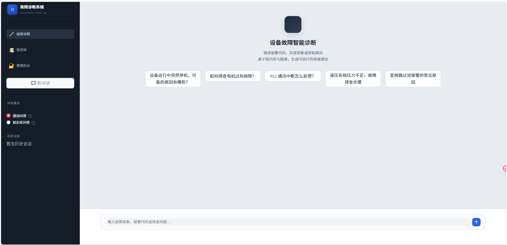
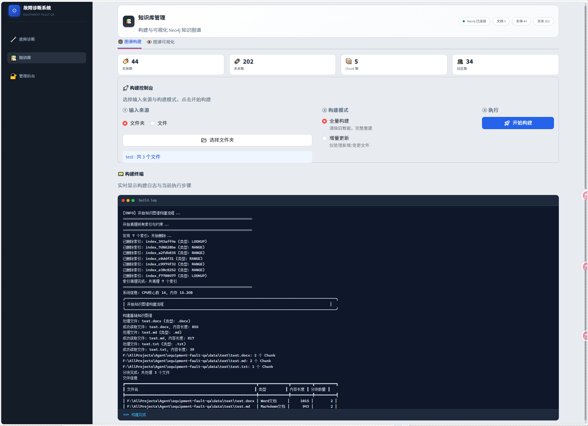
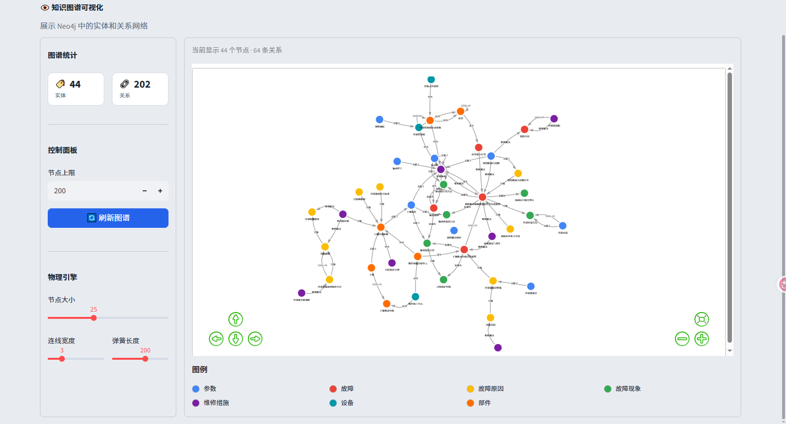
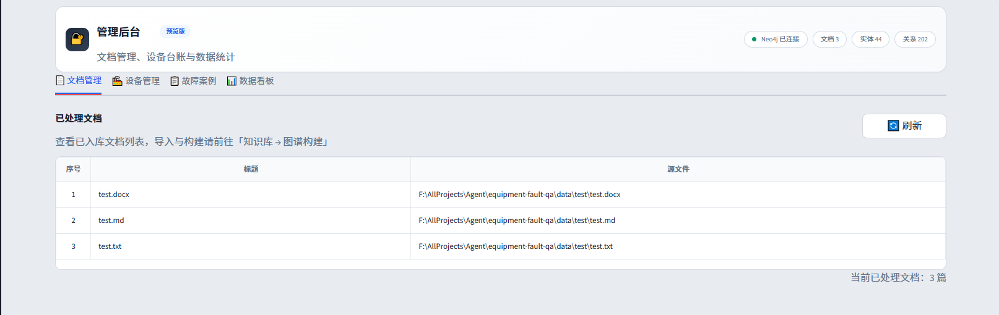
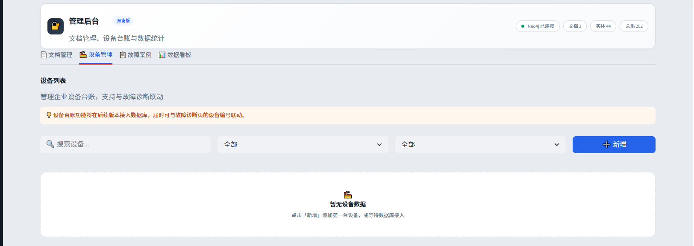
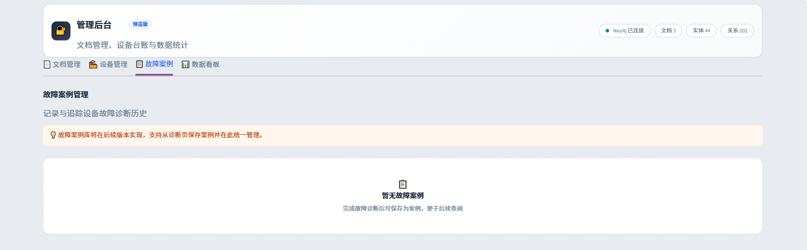
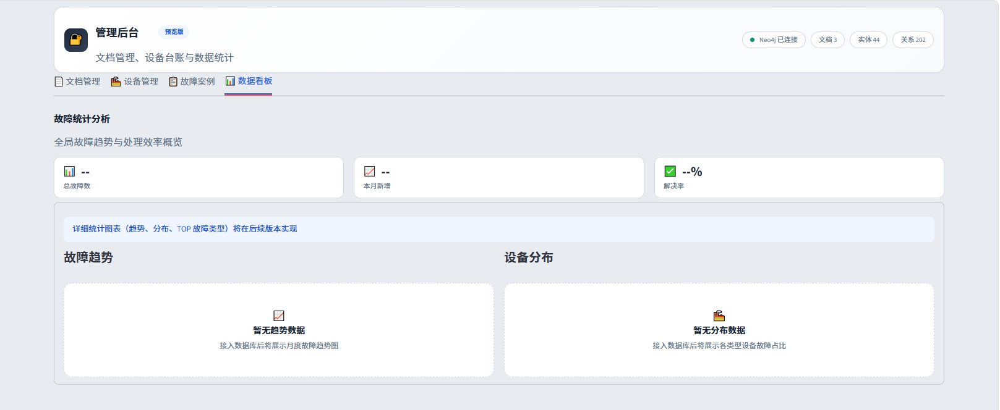

# TraceFault 🔍

> 知识图谱驱动的设备故障智能诊断系统

基于 **LangChain + LangGraph + Streamlit + Neo4j** 的企业级设备故障智能问答平台。支持通用 AI 对话、文档上传构建知识图谱、实时图谱可视化与智能问答。

---

## 界面预览

### 💬 智能问答
支持通用 AI 对话与设备故障智能问答，左侧可切换问答模式（RAG Agent / General Agent）及管理对话历史。


### 📚 知识库
文档上传 → 自动构建 Neo4j 知识图谱，支持**网页端实时显示构建过程**，构建完成后可交互浏览图谱。
#### 文档上传

#### 图谱显示


### 🔐 管理后台
文档管理、设备台账、故障案例与数据统计看板。





---

## 技术栈

| 层 | 技术 |
|---|---|
| **前端** | Streamlit（`frontend/`） |
| **后端框架** | Python / LangChain / LangGraph（`backend/`） |
| **知识图谱** | Neo4j + GDS (Graph Data Science) + APOC |
| **向量存储** | Chroma / FAISS |
| **搜索** | 本地实体搜索 + 全局社区搜索 + 图探索推理 |
| **LLM** | 兼容 OpenAI / 国产大模型 API |
| **文档处理** | PDF / DOCX / MD / CSV / JSON / YAML / TXT |
| **社区检测** | Leiden、SLLPA 算法 |
| **部署** | Docker Compose（Neo4j） |

## 核心功能

| 功能 | 说明 | 状态 |
|---|---|---|
| **💬 智能问答** | 基于 RAG + 图谱检索的多轮故障诊断对话 + 通用 AI | ✅ |
| **🔍 意图识别** | 术语归一化 → 意图分类 → 查询改写 | ✅ |
| **📄 文档处理** | PDF/DOCX/MD/CSV 等多格式解析与向量化索引 | ✅ |
| **🕸️ 图谱构建** | 从文档自动提取实体关系，构建 Neo4j 知识图谱 | ✅ |
| **👁️ 图谱可视化** | 前端交互式展示知识图谱（实体-关系-属性） | ✅ |
| **📚 知识管理** | 设备手册、故障案例的增删改查 | ✅ |
| **🏘️ 社区检测** | Leiden / SLLPA 图谱社区发现与摘要 | ✅ |
| **🔄 增量构建** | 文件变更驱动的增量图谱/索引更新 | ✅ |
| **🧪 图探索推理** | 因果链探索、假设验证、深度推理 | ✅ |
| **🔧 工单联动** | 故障上报 → 诊断 → 维修闭环 | 📋 规划中 |
| **📊 数据看板** | 故障统计分析 | 📋 规划中 |

---

## 系统架构

```
用户 query
    │
    ▼
┌────────────────────────────────────────────────┐
│          意图识别管道 (Intent Recognition)        │
│  术语归一化 → 意图分类 → 查询改写/拆分            │
└─────────────────────┬──────────────────────────┘
                      │  rewritten_query
                      ▼
┌────────────────────────────────────────────────┐
│           检索与推理层 (Search & Reasoning)      │
│   ┌──────────┐   ┌──────────┐   ┌─────────┐  │
│   │ 本地搜索  │   │ 全局搜索  │   │ 混合检索 │  │
│   │(实体级)   │   │(社区级)   │   │(图+向量) │  │
│   └─────┬────┘   └────┬─────┘   └────┬────┘  │
│         └──────────────┼──────────────┘       │
│                        ▼                      │
│   ┌────────────────────────────────────┐      │
│   │  LangGraph 多智能体编排层           │      │
│   │  RAG Agent  /  General Agent       │      │
│   └────────────────────────────────────┘      │
└─────────────────────┬──────────────────────────┘
                      │  context + reasoning
                      ▼
┌────────────────────────────────────────────────┐
│           Streamlit 前端交互界面                │
│    对话 / 知识管理 / 图谱可视化 / 流水线监控      │
└────────────────────────────────────────────────┘
```

## 项目结构

```
tracefault/
├── backend/                    # 后端核心
│   ├── agents/                 # LangGraph 智能体
│   │   ├── rag_agent.py        #   RAG 问答智能体
│   │   └── general_agent.py    #   通用对话智能体
│   ├── community/              # 图谱社区检测与摘要
│   │   ├── detector/           #   Leiden / SLLPA 检测器
│   │   └── summary/            #   社区摘要生成
│   ├── config/                 # 配置与提示词
│   │   ├── settings.py         #   全局配置
│   │   └── prompts/            #   各模块提示词模板
│   ├── graph/                  # 知识图谱核心
│   │   ├── core/               #   图谱连接、基础索引器
│   │   ├── extraction/         #   实体提取与去重
│   │   ├── indexing/           #   分块索引、嵌入管理
│   │   ├── processing/         #   实体对齐、消歧、合并
│   │   ├── structure/          #   图谱结构构建
│   │   └── graph_consistency_validator.py
│   ├── integrations/           # 构建管线集成
│   │   └── build/              #   增量/全量构建索引与图谱
│   ├── intent_recognition/     # 意图识别管道
│   │   ├── term_mapping.py     #   术语归一化
│   │   ├── intent_classifier.py#   意图分类
│   │   └── query_rewriter.py   #   查询改写与拆分
│   ├── models/                 # LLM 模型封装
│   ├── pipelines/              # 文档处理流水线
│   │   └── handle/             #   各格式文件解析器
│   ├── search/                 # 检索与推理
│   │   ├── local_search.py     #   本地实体搜索
│   │   ├── global_search.py    #   全局社区搜索
│   │   ├── tool/               #   推理工具链
│   │   │   ├── reasoning/      #     探索链推理引擎
│   │   │   ├── local_search_tool.py
│   │   │   ├── global_search_tool.py
│   │   │   ├── hybrid_tool.py
│   │   │   ├── hypothesis_tool.py
│   │   │   └── ...
│   │   └── tool_registry.py    #   工具注册中心
│   └── session_manager/        # 对话会话与压缩
├── frontend/                   # Streamlit 前端
│   ├── main.py                 #   应用入口
│   ├── pages/                  #   页面（聊天、知识、管理）
│   ├── components/             #   可复用组件
│   │   ├── chat.py             #     对话组件
│   │   ├── graph_view.py       #     图谱可视化
│   │   ├── pipeline_view.py    #     流水线监控
│   │   └── ...
│   └── utils/                  #   前端工具函数
├── data/                       # 数据目录
│   ├── documents/              #   上传的文档
│   └── vector_store/           #   向量索引
├── scripts/                    # 运维脚本
├── tests/                      # 测试
├── docker-compose.yml          # Neo4j 容器配置
└── pyproject.toml              # 项目元数据
```

---

## 快速开始

### 前置要求

- Python >= 3.11
- Docker & Docker Compose（用于 Neo4j）
- LLM API Key（OpenAI / 国产大模型）

### 1. 启动 Neo4j

```bash
docker compose up -d
```

访问 `http://localhost:7474`（如果修改了 host 端口则用对应的地址），默认账号 `neo4j`，密码见 `docker-compose.yml`。

### 2. 安装依赖

```bash
pip install -r requirements.txt
```

### 3. 配置环境变量

```bash
cp .env.example .env
# 编辑 .env: 填入 LLM API Key、Neo4j 连接信息等
```

### 4. 启动前端

```bash
streamlit run frontend/main.py
```

## 配置说明

主要配置项在 `backend/config/settings.py`，通过 `.env` 文件覆盖：

| 变量 | 说明 | 默认值 |
|---|---|---|
| `LLM_API_KEY` | 大模型 API 密钥 | — |
| `LLM_BASE_URL` | API 地址 | — |
| `LLM_MODEL` | 模型名称 | — |
| `NEO4J_URI` | Neo4j 连接地址 | `bolt://localhost:7687` |
| `NEO4J_USER` | Neo4j 用户名 | `neo4j` |
| `NEO4J_PASSWORD` | Neo4j 密码 | `12345678` |
| `VECTOR_STORE_PATH` | 向量存储路径 | `data/vector_store` |

## 开发路线图

- [x] 文档上传 → 自动构建知识图谱
- [x] Web 端实时显示构建过程
- [x] 知识图谱可视化浏览
- [x] 意图识别与查询改写
- [x] 本地 / 全局图谱检索
- [x] 社区检测与摘要（Leiden / SLLPA）
- [x] 通用 AI 对话支持
- [x] 增量构建与更新
- [ ] 工单管理与故障闭环
- [ ] 故障数据看板与统计
- [ ] 多用户权限管理

## License

MIT
